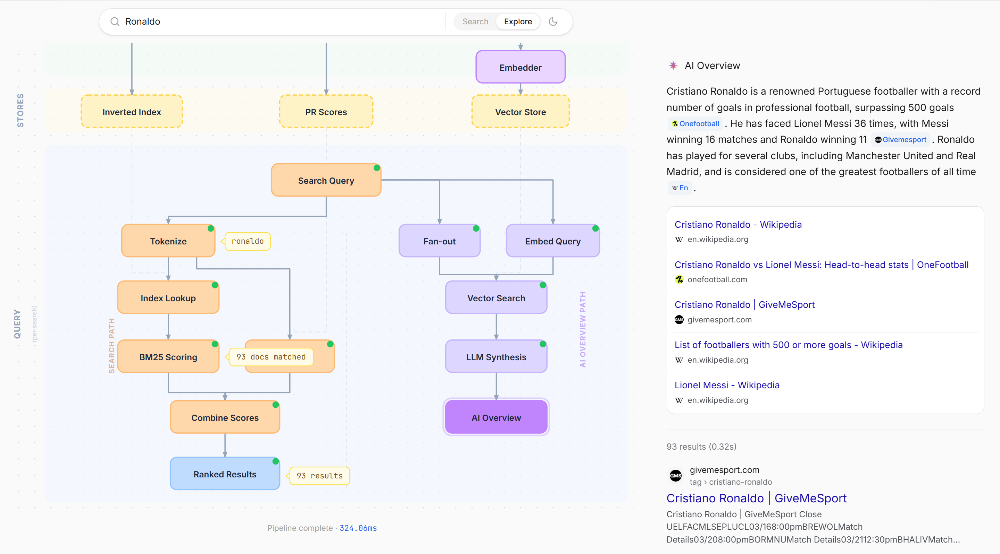
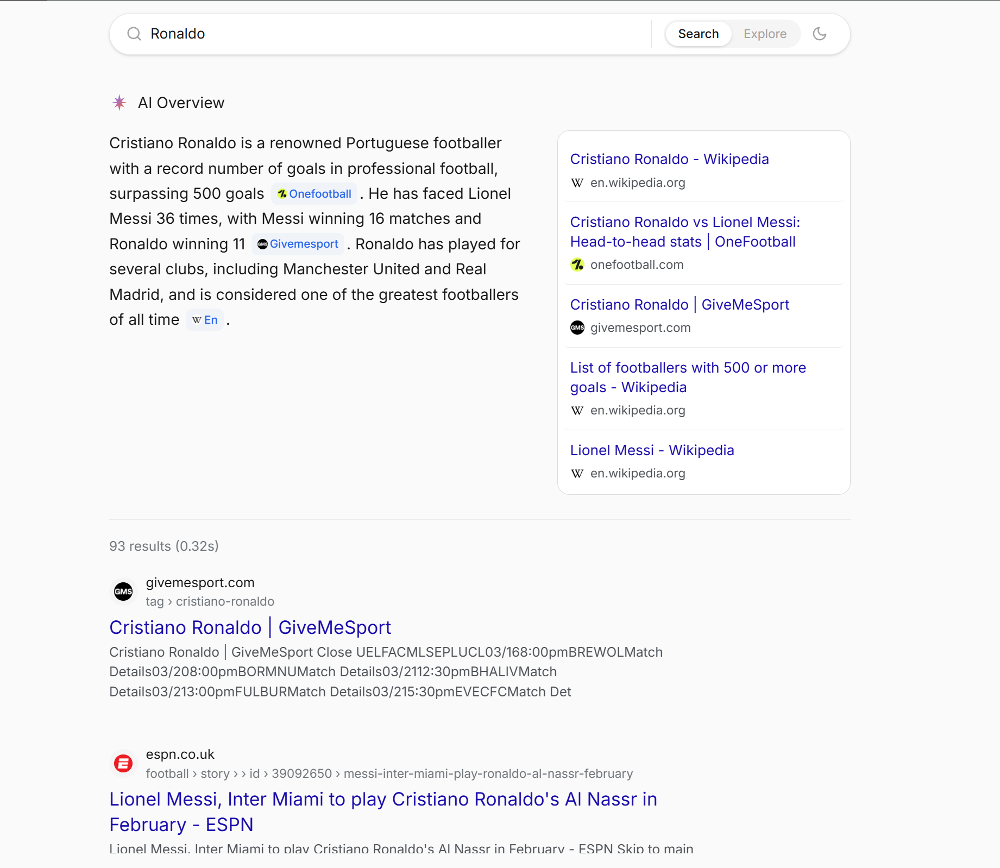

# VietSearch

### A search engine built from scratch to understand how Google really works.

**[Live Demo](https://search.hoangducviet.work)** · **[Blog Series](https://hoangducviet.work/posts/building-a-mini-search-engine-2-designing-the-web-crawler)**

| Canvas View (Explore) | Search View |
|:---:|:---:|
|  |  |

---

This is a series where I learn SEO by building a mini search engine from scratch. It covers the core pipeline behind Google Search — **Crawling, Indexing, Ranking** — plus an **AI Overviews** feature.

As someone who works in SEO, I wanted to understand search at the engineering level. Not just what Google does, but how and why. It's no coincidence that the research problems search engines needed to solve — understanding language, ranking relevance across billions of documents — drove the breakthroughs that became modern AI. The transformer paper ("Attention Is All You Need") came out of Google. So did Word2Vec and BERT. Search is where it all started.

This project started in March 2026 and is still ongoing.

## The Pipeline

This is what Google does every time you search something. I built each piece.

```
                        BUILD (offline)                                    QUERY (online)
        ┌──────────────────────────────────────┐        ┌──────────────────────────────────────────────┐
        │                                      │        │                                              │
        │   Crawler ──→ Pages DB ──┬──→ Indexer │        │   Search Query                               │
        │   (BFS,       (1000      │           │        │       │                                      │
        │   robots.txt,  pages)    ├──→ PageRank│        │       ├──→ Tokenize ──→ Index Lookup ──→ BM25│
        │   rate limit)            │           │        │       │                                  │   │
        │                          └──→ Chunker │        │       ├──→ Fan-out ──→ Vector Search ──→ LLM│
        │                               │      │        │       │                                  │   │
        │                          Embedder     │        │       └──→ PageRank Lookup               │   │
        │                               │      │        │                    │                      │   │
        │                               ▼      │        │                    ▼                      │   │
        │   ┌─────────┐ ┌──────────┐ ┌───────┐ │        │              Combine Scores ──→ Results   │   │
        │   │Inverted │ │PageRank  │ │Vector │ │        │                                     │    │   │
        │   │ Index   │ │ Scores   │ │ Store │ │◄───────┤                              AI Overview  │   │
        │   └─────────┘ └──────────┘ └───────┘ │        │                                          │   │
        └──────────────────────────────────────┘        └──────────────────────────────────────────────┘
                    ▲                                                        ▲
                    │             Databases are the bridge                   │
                    └───────────────────────────────────────────────────────┘
```

### What each piece does

| Stage | What it does | How | Numbers |
|-------|-------------|-----|---------|
| **Crawler** | Downloads web pages | BFS traversal, robots.txt compliance, 1.5s rate limiting | 1,000 pages from Wikipedia, BBC Sport, ESPN |
| **Indexer** | Maps every word to the pages containing it | Tokenization → stopword removal → inverted index via PostgreSQL COPY | 145,736 terms, 1,057,023 postings |
| **PageRank** | Scores page authority from link structure | Iterative algorithm (d=0.85, 20 iterations), handles dangling nodes | Scores for all 1,000 pages |
| **Chunker + Embedder** | Prepares pages for semantic search | Split into ~300-token chunks, embed with Voyage AI, store as pgvector | ~15,000 chunks |
| **BM25** | Scores text relevance | Term frequency × inverse document frequency × length normalization | k1=1.2, b=0.75 |
| **Ranking** | Combines signals | 70% BM25 + 30% PageRank, min-max normalized | Tunable live in the UI |
| **AI Overview** | Generates a summary with citations | Query fan-out → hybrid retrieval (vector + keyword) → Groq streaming | Llama 3.3 70B, cached 24h |

## The UI

The frontend is a **React Flow canvas** that visualizes the entire pipeline as an interactive node graph. Search a query and watch data flow through each stage in real-time.

- **Left side**: Build pipeline (crawler → indexer → stores)
- **Right side**: Query pipeline (tokenize → lookup → rank → results)
- **Click any node** to see real data — actual postings from the inverted index, PageRank scores, RAG chunks
- **Live WebSocket** progress during crawl/index/embed jobs
- **Google-style results** with score breakdowns and AI Overview with citations

## Tech Stack

| Layer | Tech |
|-------|------|
| Frontend | Next.js 16, React 19, React Flow, Tailwind v4, TypeScript |
| Backend | FastAPI, Python 3.12+ |
| Database | PostgreSQL 16 + pgvector |
| LLM | Groq (Llama 3.3 70B) |
| Embeddings | Voyage AI (voyage-3-lite, 768d) |
| Hosting | Railway |

## Project Structure

```
backend/
├── crawler/        # BFS web crawler (fetcher, parser, queue manager)
├── indexer/        # inverted index builder + tokenizer
│   └── docs/       # technical write-ups on indexing decisions
├── ranker/         # BM25 + PageRank
├── search/         # query engine + pipeline explainer
├── rag/            # chunker, embedder, retriever, query fan-out
├── ai_overview/    # Groq streaming, response caching
├── api/            # REST endpoints + WebSocket jobs
└── scripts/        # CLI: crawl, index, pagerank, build_rag

frontend/
├── app/            # Next.js app router
├── components/
│   └── canvas/     # React Flow nodes, edges, detail panels
└── lib/            # API client, types, hooks
```

## Run It Yourself

### Prerequisites
- Python 3.12+
- Node.js 18+
- PostgreSQL 16+ with pgvector
- API keys: [Groq](https://console.groq.com), [Voyage AI](https://dash.voyageai.com)

### Backend

```bash
cd backend
pip install -e .

# Start Postgres with pgvector
docker run -d --name search-pg \
  -e POSTGRES_USER=searchengine \
  -e POSTGRES_PASSWORD=searchengine \
  -e POSTGRES_DB=searchengine \
  -p 5432:5432 pgvector/pgvector:pg16

# Configure
cp .env.example .env  # add your GROQ_API_KEY and VOYAGE_API_KEY

# Initialize database
python db.py

# Build the entire search index (run in order)
python scripts/crawl.py        # ~25 min (rate limited)
python scripts/index.py        # ~2 sec
python scripts/pagerank.py     # ~1 sec
python scripts/build_rag.py    # ~5 min (API calls)

# Start
uvicorn main:app --reload
```

### Frontend

```bash
cd frontend
npm install
npm run dev
```

Open [localhost:3000](http://localhost:3000).

## Roadmap

### In Progress
- [ ] Canvas UX polish — clickable data previews, detail panel layout, distinct node shapes

### Planned
- [ ] **Sports OneBox** — live football match cards (Champions League, World Cup) displayed above search results, like Google's Game Spotlight ([#15](https://github.com/hdviettt/mini-search-engine/issues/15))
- [ ] **Auto-crawling** — scheduled re-crawls, freshness tracking, auto-unindex dead pages ([#23](https://github.com/hdviettt/mini-search-engine/issues/23), [#24](https://github.com/hdviettt/mini-search-engine/issues/24))
- [ ] **Query intent detection** — classify sports vs general queries to trigger structured results ([#16](https://github.com/hdviettt/mini-search-engine/issues/16))

### Future
- [ ] Incremental indexing (no full rebuild) ([#18](https://github.com/hdviettt/mini-search-engine/issues/18))
- [ ] Stemming support ([#19](https://github.com/hdviettt/mini-search-engine/issues/19))
- [ ] Knowledge Graph — entity understanding beyond text matching ([#20](https://github.com/hdviettt/mini-search-engine/issues/20))
- [ ] Spell correction + "Did you mean?" ([#22](https://github.com/hdviettt/mini-search-engine/issues/22))
- [ ] Freshness signal in ranking ([#25](https://github.com/hdviettt/mini-search-engine/issues/25))

## Blog Series

1. [Why I'm Building a Search Engine](https://hoangducviet.work/posts/building-a-mini-search-engine-1-why)
2. [Designing the Web Crawler](https://hoangducviet.work/posts/building-a-mini-search-engine-2-designing-the-web-crawler)
3. Building the Inverted Index *(coming soon)*
4. Ranking with BM25 + PageRank *(coming soon)*

## Author

Built by [Hoang Duc Viet](https://hoangducviet.work) — AI Leader at SEONGON, Vietnam's largest Google Ads & SEO agency.
