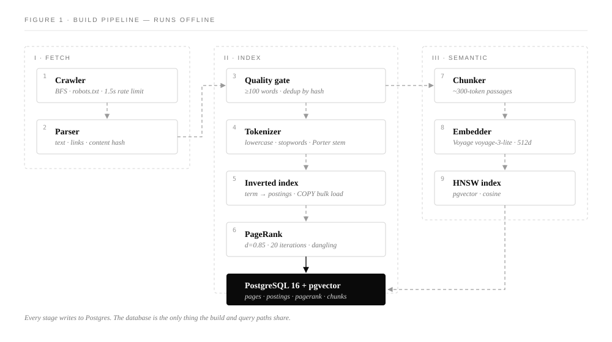
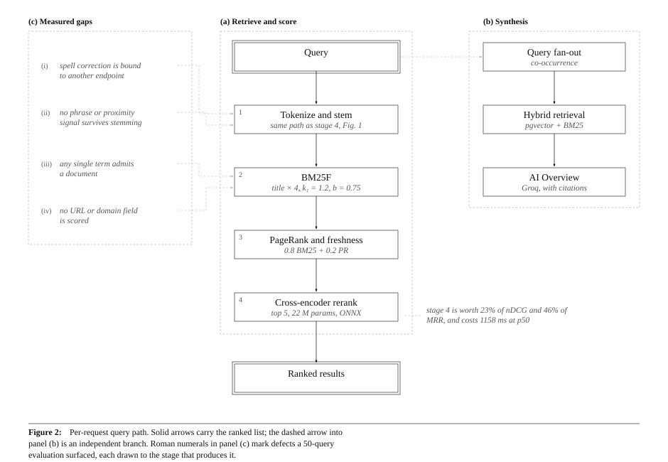

# Mini Search Engine

### A search engine built from scratch to understand how Google really works.

**[Live Demo](https://search.hoangducviet.work)** · **[Blog Series](https://hoangducviet.work/posts/building-a-mini-search-engine-1-why)**


---

A mini search engine built from scratch that covers the core pipeline behind Google Search — **Crawling, Indexing, Ranking** — plus **Neural Reranking**, **AI Overviews**, and **Sports OneBox**.

I work in SEO, and I wanted to understand search at the engineering level. Not just what Google does, but how and why. It is no coincidence that the research problems search engines had to solve — understanding language, ranking relevance across billions of documents — drove the breakthroughs that became modern AI. The transformer paper came out of Google. So did Word2Vec and BERT. Search is where it started.

Started March 2026. Still ongoing.

## The Pipeline

Two pipelines that share nothing but a database. The build path runs offline and
fills Postgres; the query path reads it.





The lettered gaps in Figure 2 are what a 50-query evaluation surfaced, not
guesses. See [part 9](docs/posts/09-measuring-the-search-engine.md) for the
measurement and [`CLAUDE.md`](CLAUDE.md) for the fix order.

### What each piece does

| Stage | What it does | How | Numbers |
|-------|-------------|-----|---------|
| **Crawler** | Downloads web pages | BFS traversal, robots.txt compliance, 1.5s rate limiting, dead page tracking | ~1,000+ pages from Wikipedia, BBC Sport, ESPN, FBref, Transfermarkt |
| **Indexer** | Maps every word to the pages containing it | Tokenization (Porter stemmer) → stopword removal → inverted index via PostgreSQL COPY | 100K+ terms, 1M+ postings |
| **PageRank** | Scores page authority from link structure | Iterative algorithm (d=0.85, 20 iterations), handles dangling nodes | Scores for all live pages |
| **Chunker + Embedder** | Prepares pages for semantic search | Split into ~300-token chunks, embed with Voyage AI voyage-3-lite, store as pgvector | ~15,000+ chunks (512d vectors) |
| **BM25** | Scores text relevance | BM25F with 4× title weight, term frequency × inverse document frequency × length normalization | k1=1.2, b=0.75 |
| **Neural Reranker** | Refines top results with a cross-encoder | ONNX inference with ms-marco-MiniLM-L-6-v2 (22M params), runs locally on CPU | Reranks top 40 candidates, ~10 ms each |
| **Ranking** | Combines signals | 80% BM25 + 20% PageRank, exponential freshness decay, 7-day recency bonus | min-max normalized, tunable live in the UI |
| **Spell correction** | Fixes typos before searching | Levenshtein edit-distance ≤ 2, vocabulary from page titles + indexed stems | Proper nouns protected via terms table |
| **AI Overview** | Generates a summary with citations | Co-occurrence fan-out → hybrid retrieval (vector + keyword) → Groq streaming with retry | Llama 3.3 70B, cached 24h |
| **AI Chat** | Follow-up conversation with context | Multi-turn chat grounded in retrieved chunks, inline citations | Groq streaming |
| **Sports OneBox** | Live match cards above results | Keyword detection for teams/leagues → API-Football integration | Live scores, standings, fixtures |

## The UI

The frontend is a **React Flow canvas** that visualizes the entire pipeline as an interactive node graph. Search a query and watch data flow through each stage in real-time.

- **Left side**: Build pipeline (crawler → indexer → stores)
- **Right side**: Query pipeline (tokenize → lookup → rank → results)
- **Click any node** to see real data — actual postings from the inverted index, PageRank scores, RAG chunks
- **Live WebSocket** progress during crawl/index/embed jobs
- **Google-style results** with score breakdowns, AI Overview with citations, and follow-up chat
- **DuckDuckGo-style hero** with live dashboard charts on the landing page
- **Sports OneBox** — live match cards, standings, and fixtures for sports queries

## Tech Stack

| Layer | Tech |
|-------|------|
| Frontend | Next.js 16, React 19, React Flow, Tailwind v4, TypeScript |
| Backend | FastAPI, Python 3.12+ |
| Database | PostgreSQL 16 + pgvector |
| Reranking | ONNX Runtime (ms-marco-MiniLM-L-6-v2, 22M params, CPU) |
| LLM | Groq API (Llama 3.3 70B via `llama-3.3-70b-versatile`) |
| Embeddings | Voyage AI API (voyage-3-lite, 512d) |
| Sports Data | API-Football |
| Hosting | Railway |

## Project Structure

```
backend/
├── crawler/        # BFS web crawler (fetcher, parser, queue manager)
├── indexer/        # inverted index builder + tokenizer
│   └── docs/       # technical write-ups on indexing decisions
├── ranker/         # BM25F + PageRank + ONNX neural reranker
├── search/         # query engine, spell correction, pipeline explainer
├── rag/            # chunker, embedder, retriever, query fan-out
├── ai_overview/    # Groq streaming, response caching, follow-up chat
├── sports/         # sports query detection + API-Football integration
├── api/            # REST endpoints + WebSocket jobs + scheduling
└── scripts/        # CLI: crawl, index, pagerank, build_rag

frontend/
├── app/            # Next.js app router (search + explore + dashboard)
├── components/
│   ├── canvas/     # React Flow nodes, edges, detail panels
│   └── playground/ # control panels for live tuning
├── hooks/          # useSearchEngine, useWebSocket, useResizable
└── lib/            # API client, types, hooks
```

## Run It Yourself

### Prerequisites
- Python 3.12+
- Node.js 18+
- PostgreSQL 16+ with pgvector
- API keys: [Groq](https://console.groq.com), [Voyage AI](https://dash.voyageai.com)

### Endpoint access

Read endpoints — search, explore, stats — are public.

Operational endpoints — crawl, index rebuild, embedding rebuild, PageRank recompute,
schedules — require `X-API-Key` matching the `ADMIN_API_KEY` environment variable.
If `ADMIN_API_KEY` is unset, those endpoints return `503` rather than running unprotected.

The playground's Operations tab has a field for the key. It is entered once and
kept in that browser's `localStorage` — deliberately not a `NEXT_PUBLIC_*`
variable, which would be inlined into the client bundle and visible to every
visitor.

### Backend

```bash
cd backend
pip install -e .

# Download the ONNX cross-encoder used for neural reranking (~90 MB).
# Skip this and search still works, but reranking is disabled.
python scripts/download_model.py

# Start Postgres with pgvector
docker run -d --name search-pg \
  -e POSTGRES_USER=searchengine \
  -e POSTGRES_PASSWORD=searchengine \
  -e POSTGRES_DB=searchengine \
  -p 5432:5432 pgvector/pgvector:pg16

# Configure
cp .env.example .env  # add GROQ_API_KEY, VOYAGE_API_KEY, ADMIN_API_KEY

# Initialize database
python db.py

# Build the entire search index (run in order)
python scripts/crawl.py        # ~25 min (rate limited)
python scripts/index.py        # ~2 sec
python scripts/pagerank.py     # ~1 sec
python scripts/build_rag.py    # ~5 min (API calls)

# Start
uvicorn main:app --reload
```

### Frontend

```bash
cd frontend
npm install
npm run dev
```

Open [localhost:3000](http://localhost:3000).

## Measuring quality

Ranking changes are judged on numbers, not on a handful of spot-checked queries.
`eval/` holds 50 labeled queries across six intent types — entity, informational,
navigational, multi-term, misspelled, and queries that should return nothing at all.

```bash
python eval/run.py --baseline                   # record current behaviour
python eval/run.py --compare eval/baseline.json # what a change moved
```

It reports nDCG@10, MRR, zero-result precision and latency p50/p95, broken down
by intent, plus the queries that regressed most. To price the cross-encoder,
restart the API with `RERANK_ENABLED=false` and compare — it costs about 10 ms
per candidate.

### Where it stands, and what the eval does not tell you

Five rerank depths were deployed and measured. Raising `RERANK_TOP_K` from 5 to
40 is the largest single improvement the project has made:

| | nDCG@10 | MRR | zero-result | p50 |
|---|---|---|---|---|
| baseline, depth 5 | 0.7394 | 0.6259 | 0.40 | 1325 ms |
| **current, depth 40** | **0.8884** | **0.8370** | **0.60** | **438 ms** |

**Read those against a keyword counter.** A five-line function that counts query
words in the title scores **0.7551** on this eval, beating the original
pipeline. The labels in `eval/queries.yaml` are substrings of entity names,
which is what appears in the title of a page about that entity, so the metric
rewards string overlap by construction — 88% of everything it grades relevant
contains a literal query term.

It is still useful for detecting regressions, which is what it was built for. It
is not a measure of semantic ranking quality, and a number from it should never
be quoted without the keyword baseline beside it. That was found by
[mini-reranker](https://github.com/hdviettt/mini-reranker), which needed a
trustworthy ruler and discovered this one was bent.

## Development

```bash
cd backend
pytest tests -q     # 89 tests: tokenizer, ranking maths, SSRF guard, auth, request bounds
ruff check .
```

CI runs ruff + pytest on the backend and tsc + eslint on the frontend.
[`CLAUDE.md`](CLAUDE.md) documents the architecture, the invariants, and the
mistakes already made once — it is what an agent (or a person) reads before
changing anything here.

## Blog Series

1. [Why I'm Building a Search Engine](https://hoangducviet.work/posts/building-a-mini-search-engine-1-why)
2. [Designing the Web Crawler](https://hoangducviet.work/posts/building-a-mini-search-engine-2-designing-the-web-crawler)
3. Building the Inverted Index
4. Ranking with BM25 + PageRank
5. Neural Reranking with a Cross-Encoder
6. Query Fan-out and Hybrid Retrieval
7. AI Overviews
8. AI Mode
9. [I measured my own search engine](docs/posts/09-measuring-the-search-engine.md)

## Related

[**mini-reranker**](https://github.com/hdviettt/mini-reranker) — the
cross-encoder in step 5 of that list, rebuilt by hand. BPE tokenizer, scaled
dot-product attention, the encoder stack, the training loop, no pretrained
weights. It is measured against `ms-marco-MiniLM-L-6-v2` on the same 50 queries,
and it loses: 0.5963 against 0.7196 on MS MARCO's own human judgments.

Its more useful output was the ruler. Building a trustworthy measurement for it
surfaced four defects here — a min-score filter deleting 60% of everything the
cross-encoder scored, a rerank depth eight times too shallow, a playground
canvas describing a pipeline the engine was not running, and a latency figure in
this repository's own notes that blamed the model for a cold start.

## Author

**Hoang Duc Viet** — AI Leader at [SEONGON](https://seongon.com), Vietnam's largest SEO agency.

I build agentic AI systems and write about how search actually works underneath.

[hoangducviet.work](https://hoangducviet.work) · [GitHub](https://github.com/hdviettt) · [LinkedIn](https://linkedin.com/in/hdviettt)

